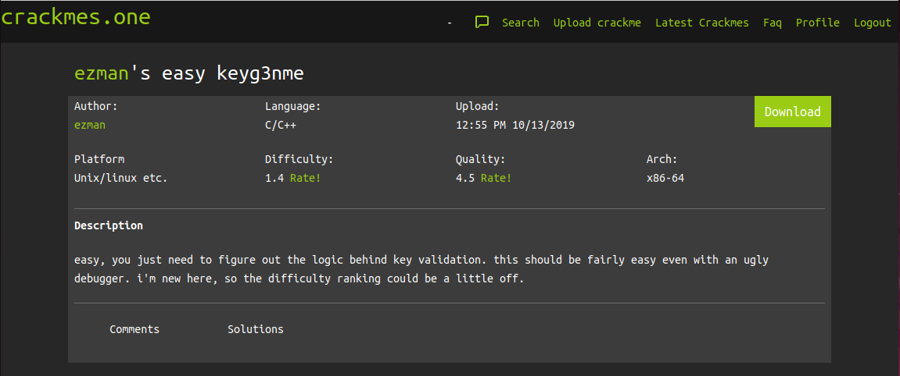
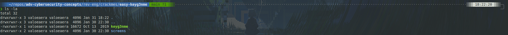
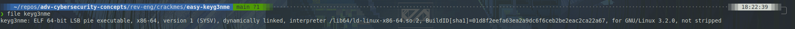
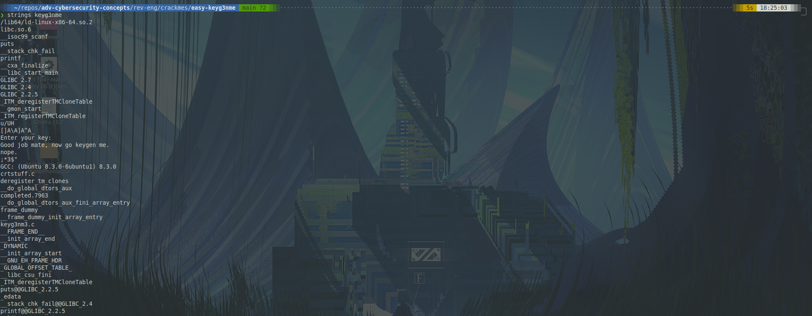
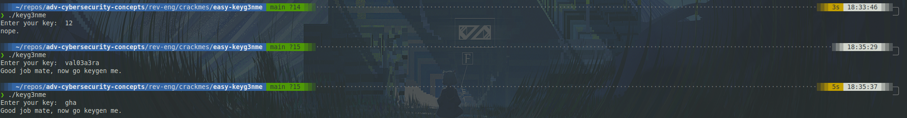
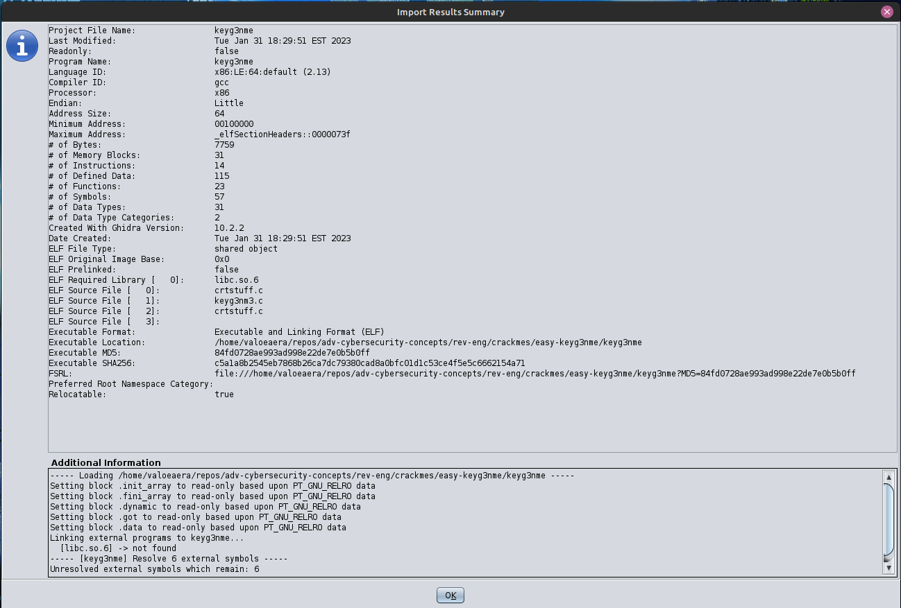
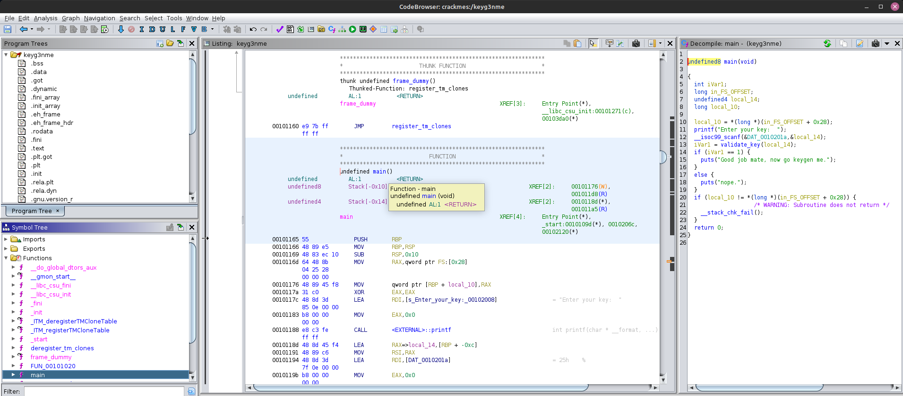
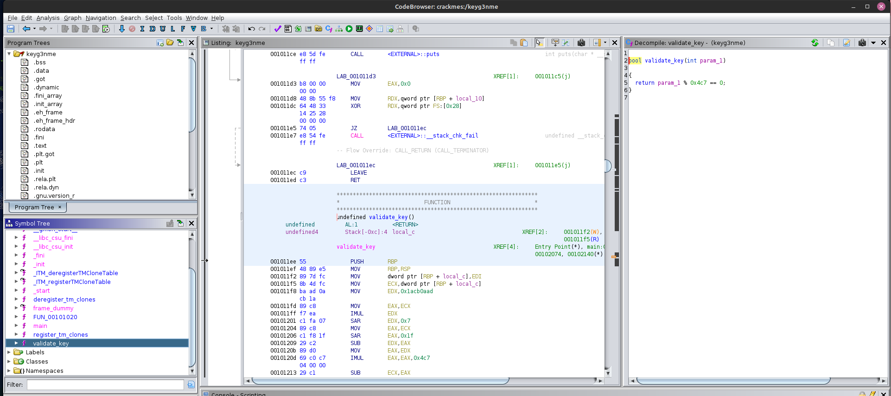
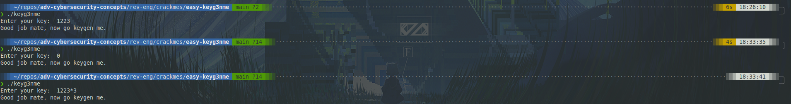
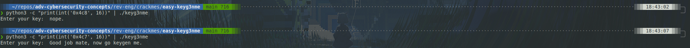

## Static Analysis

I started off by downloading and unzipping the challenge.

Using `file`, I determined that this file is ELF Executable (64-bit).

Looking at the `strings` of the file, I note some interesting results:

- `Enter your key:`: asks for user input
- `Good job mate, now go keygen me.`: looks like a success message
- `nope.`: pretty curt failure message
- `main` and `validate_key`: probably function names

## Dynamic Analysis

Initially I was confused, as the program seemed to arbitrarily return the success message. Through some trial-and-error, I discovered that numeric keys returned the failure message, whereas any string with non-numeric characters returned the success message. I will find the explanation for this behavior in Ghidra.

## Decompiling -- Ghidra

In its import results, Ghidra indicates basic information about the file.

Starting with `main()`, the program defines some variables:

- int `iVar1`: controls what the program returns
  - `1` is success
  - other values are failure
- undefined4 `local_14`: stores the key that the user inputs
  - notably not explicitly typed
  - this causes the unusual behavior discussed earlier in combination with the `validate_key()` function's implementation

Then, the program prints `Enter your key: ` and waits for user input. That input is fed into the `validate_key()` function, whose return value is stored in `iVar1`. Lastly depending on the value of `iVar1`, the program will either print the success message or the failure message.

`validate_key()` is very simple. It returns a bool based on whether the parameter (the user's key) is divisible by `0x4c7` (1223 in decimal). It appears that the odd behavior is caused by type shenanigans with that parameter. My best guess is that it is not properly cast to an integer, which causes the return expression to evaluate to `True`.

## Solution

When giving the program a multiple of 1223 (like 0), I got the success message even though the input was purely numeric (not tripping the bug discussed earlier). Using python to give the program hex input also shows this functionality.

While it was somewhat disappointing that the program had a very obvious flaw, it is true to real life, where malware is often very rough and contains bugs. I hope to tackle more difficult crackmes yet this week.

A simpler version of this writeup that I submitted to crackmes is available [here](./writeup.txt).
