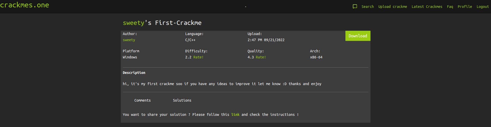
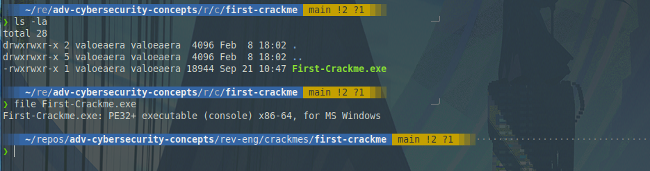
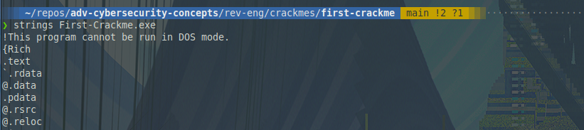
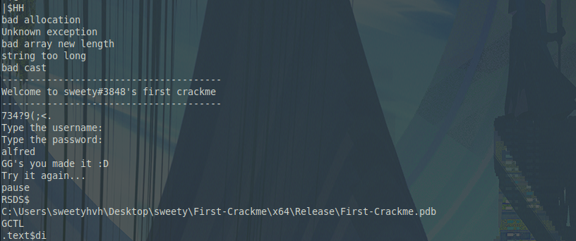
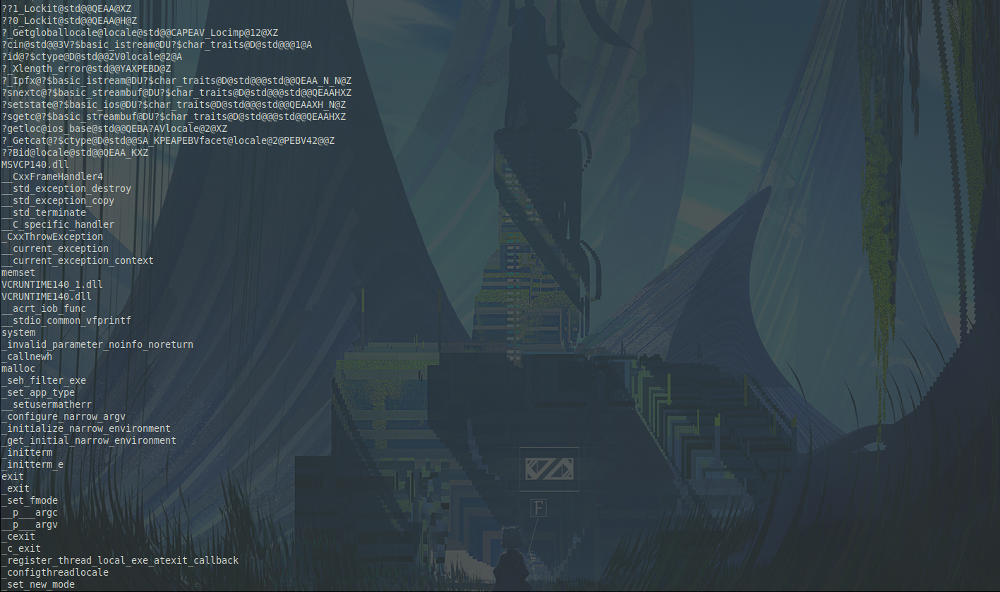
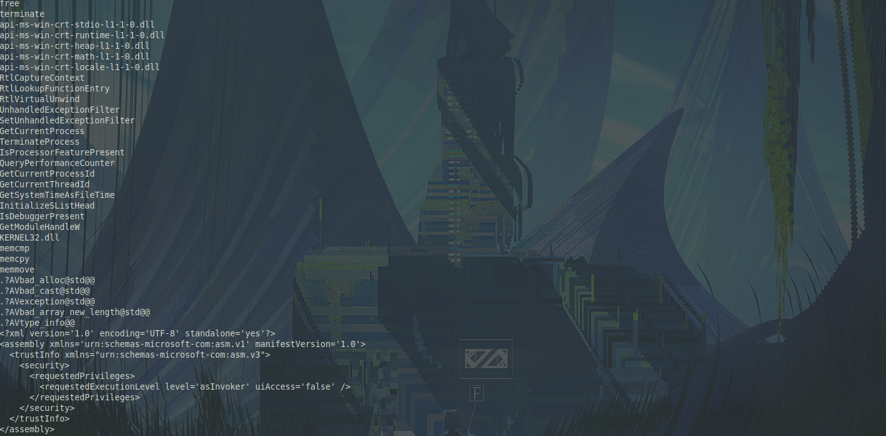
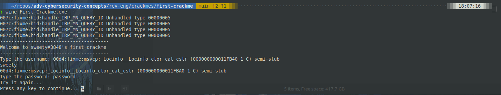
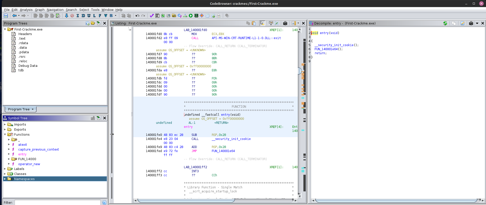
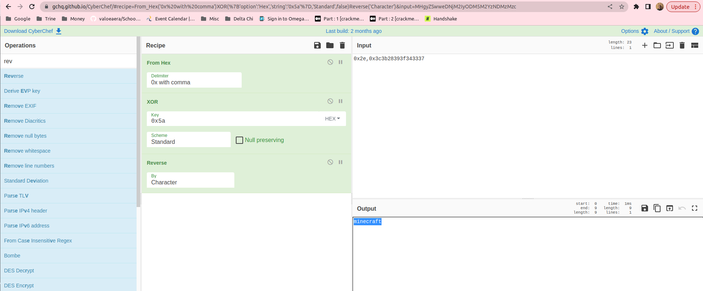
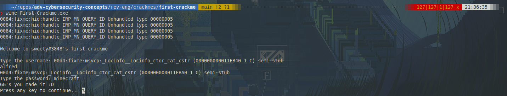

## Static Analysis



I started off by downloading and unzipping the challenge. Using `file`, I determined that this file is PE32 executable. It's for Windows as the challenge info indicates.






In the file's strings, I can see I lot of interesting things. The first screenshot shows typical PE headers, which show that the file is likely not packed or obfuscated. This is further indicated in the next screenshot, which appears to show some text that gets sent to stdout. (As a hint, I can actually see some of the hashed password in this output too: `734?9:;<.`) In the following two screenshots, I can see a lot of imported Windows libraries.

## Dynamic Analysis



When I run the program in Wine, the program asks for a username and password. I obviously don't have one, so I get the failure message I found in the strings. Time to jump into Ghidra.

## Decompiling -- Ghidra



The entry() function is the aptly-named entry point into the program. It calls two functions: `__security_init_cookie()` and `FUN_140001e64()`. `__security_init_cookie()` does some setup tasks for the program, so I'll skip to `FUN_140001e64()`. The de-compiled code looks as such:

```c++
uint FUN_140001e64(void)

{
  undefined8 uVar1;
  bool bVar2;
  int iVar3;
  ulonglong uVar4;
  code **ppcVar5;
  longlong *plVar6;
  undefined8 uVar7;
  undefined8 *puVar8;
  uint *puVar9;
  ulonglong uVar10;
  uint unaff_EBX;
  undefined8 in_R9;

  uVar4 = __scrt_initialize_crt(1);
  if ((char)uVar4 == '\0') {
    FUN_140002528(7);
  }
  else {
    bVar2 = false;
    uVar4 = __scrt_acquire_startup_lock();
    unaff_EBX = unaff_EBX & 0xffffff00 | (uint)(uVar4 & 0xff);
    if (DAT_140005120 != 1) {
      if (DAT_140005120 == 0) {
        DAT_140005120 = 1;
        iVar3 = _initterm_e(&DAT_1400032d0,&DAT_1400032e8);
        if (iVar3 != 0) {
          return 0xff;
        }
        _initterm(&DAT_1400032b0,&DAT_1400032c8);
        DAT_140005120 = 2;
      }
      else {
        bVar2 = true;
      }
      __scrt_release_startup_lock((char)(uVar4 & 0xff));
      ppcVar5 = (code **)FUN_140002510();
      if ((*ppcVar5 != (code *)0x0) &&
         (uVar4 = FUN_140002108((longlong)ppcVar5), (char)uVar4 != '\0')) {
        (**ppcVar5)(0,2);
      }
      plVar6 = (longlong *)FUN_140002518();
      if ((*plVar6 != 0) && (uVar4 = FUN_140002108((longlong)plVar6), (char)uVar4 != '\0')) {
        _register_thread_local_exe_atexit_callback(*plVar6);
      }
      uVar7 = _get_initial_narrow_environment();
      puVar8 = (undefined8 *)__p___argv();
      uVar1 = *puVar8;
      puVar9 = (uint *)__p___argc();
      uVar10 = (ulonglong)*puVar9;
      unaff_EBX = FUN_140001300(uVar10,uVar1,uVar7,in_R9);
      uVar4 = FUN_14000267c();
      if ((char)uVar4 != '\0') {
        if (!bVar2) {
          _cexit();
        }
        __scrt_uninitialize_crt(CONCAT71((int7)(uVar10 >> 8),1),'\0');
        return unaff_EBX;
      }
      goto LAB_140001fd0;
    }
  }
  FUN_140002528(7);
LAB_140001fd0:

  exit(unaff_EBX);
}
```

When I was first taking a look at this program, I inspected each function as I came to it in order. For brevity, the interesting bit is `unaff_EBX = FUN_140001300(uVar10,uVar1,uVar7,in_R9);`. This function's code looks as such:

```c++
void FUN_140001300(undefined8 param_1,undefined8 param_2,undefined8 param_3,undefined8 param_4)

{
  void *pvVar1;
  bool bVar2;
  ulonglong uVar3;
  int iVar4;
  undefined8 *puVar5;
  void *****pppppvVar6;
  void *_Memory;
  undefined8 ****ppppuVar7;
  char *pcVar8;
  undefined8 ****ppppuVar9;
  char *_Buf2;
  ulonglong uVar10;
  uint uVar11;
  size_t sVar12;
  ulonglong uVar13;
  undefined8 ****ppppuVar14;
  undefined auStack_f8 [32];
  uint local_d8;
  undefined4 uStack_d4;
  undefined4 uStack_d0;
  undefined4 uStack_cc;
  ulonglong local_c8;
  ulonglong local_c0;
  undefined8 *local_b8;
  void *****local_b0 [2];
  size_t local_a0;
  ulonglong local_98;
  undefined8 ****local_90 [2];
  size_t local_80;
  ulonglong local_78;
  undefined8 ****local_70 [2];
  size_t local_60;
  ulonglong local_58;
  undefined8 local_50;
  undefined4 uStack_48;
  undefined4 uStack_44;
  undefined8 local_40;
  undefined8 local_38;
  ulonglong local_30;

  local_30 = DAT_140005010 ^ (ulonglong)auStack_f8;
  uVar10 = 0;
  local_b8 = (undefined8 *)((ulonglong)local_b8 & 0xffffffff00000000);
  local_80 = 0;
  local_78 = 0xf;
  local_90[0] = (undefined8 ****)0x0;
  local_40 = 9;
  local_38 = 0xf;
  local_50 = 0x3c3b28393f343337;
  uStack_48 = CONCAT22(uStack_48._2_2_,0x2e);
  local_60 = 0;
  local_58 = 0xf;
  local_70[0] = (undefined8 ****)0x0;
  FUN_140001020("---------------------------------------\n",param_2,param_3,param_4);
  FUN_140001020("Welcome to sweety#3848\'s first crackme",param_2,param_3,param_4);
  FUN_140001020("\n---------------------------------------",param_2,param_3,param_4);
  FUN_140001020("\nType the username: ",param_2,param_3,param_4);
  ppppuVar9 = local_90;
  FUN_1400018d0((longlong *)cin_exref,ppppuVar9);
  FUN_140001020("Type the password: ",ppppuVar9,param_3,param_4);
  _Buf2 = (char *)local_70;
  FUN_1400018d0((longlong *)cin_exref,(void **)_Buf2);
  uVar3 = local_58;
  ppppuVar14 = local_70[0];
  ppppuVar9 = local_90[0];
  ppppuVar7 = local_90;
  if (0xf < local_78) {
    ppppuVar7 = local_90[0];
  }
  sVar12 = local_80;
  if (local_80 == 6) {
    _Buf2 = "alfred";
    iVar4 = memcmp(ppppuVar7,"alfred",6);
    if (iVar4 != 0) goto LAB_140001525;
    local_c8 = 9;
    local_c0 = 0xf;
    local_d8 = (uint)local_50;
    uStack_d4 = local_50._4_4_;
    uStack_d0 = uStack_48;
    uStack_cc = uStack_44;
    local_b8 = (undefined8 *)&local_d8;
    FUN_1400016a0(local_b0,(undefined8 *)&local_d8);
    uVar13 = uVar10;
    if (local_c8 != 0) {
      do {
        puVar5 = (undefined8 *)&local_d8;
        if (0xf < local_c0) {
          puVar5 = (undefined8 *)CONCAT44(uStack_d4,local_d8);
        }
        pppppvVar6 = local_b0;
        if (0xf < local_98) {
          pppppvVar6 = local_b0[0];
        }
        *(byte *)((longlong)pppppvVar6 + uVar10) = *(byte *)((longlong)puVar5 + uVar10) ^ 0x5a;
        uVar11 = (int)uVar13 + 1;
        uVar10 = uVar10 + 1;
        uVar13 = (ulonglong)uVar11;
      } while ((ulonglong)(longlong)(int)uVar11 < local_c8);
    }
    if (0xf < local_c0) {
      pvVar1 = (void *)CONCAT44(uStack_d4,local_d8);
      _Memory = pvVar1;
      if ((0xfff < local_c0 + 1) &&
         (_Memory = *(void **)((longlong)pvVar1 + -8),
         0x1f < (ulonglong)((longlong)pvVar1 + (-8 - (longlong)_Memory)))) goto LAB_140001559;
      free(_Memory);
    }
    local_c8 = 0;
    local_c0 = 0xf;
    local_d8 = local_d8 & 0xffffff00;
    uVar10 = 3;
    _Buf2 = (char *)local_b0;
    if (0xf < local_98) {
      _Buf2 = (char *)local_b0[0];
    }
    ppppuVar7 = local_70;
    if (0xf < uVar3) {
      ppppuVar7 = ppppuVar14;
    }
    sVar12 = local_60;
    if ((local_60 != local_a0) || (iVar4 = memcmp(ppppuVar7,_Buf2,local_60), iVar4 != 0))
    goto LAB_140001525;
    bVar2 = true;
  }
  else {
LAB_140001525:
    bVar2 = false;
  }
  if (((uVar10 & 1) != 0) && (0xf < local_98)) {
    _Buf2 = (char *)(local_98 + 1);
    pppppvVar6 = local_b0[0];
    if ((void *****)0xfff < _Buf2) {
      _Buf2 = (char *)(local_98 + 0x28);
      pppppvVar6 = (void *****)local_b0[0][-1];
      if (0x1f < (ulonglong)((longlong)local_b0[0] + (-8 - (longlong)pppppvVar6))) {
LAB_140001559:

        _invalid_parameter_noinfo_noreturn();
      }
    }
    free(pppppvVar6);
  }
  pcVar8 = "GG\'s you made it :D\n";
  if (!bVar2) {
    pcVar8 = "Try it again...\n";
  }
  FUN_140001020(pcVar8,_Buf2,sVar12,param_4);
  system("pause");
  if (0xf < uVar3) {
    ppppuVar7 = ppppuVar14;
    if ((0xfff < uVar3 + 1) &&
       (ppppuVar7 = (undefined8 ****)ppppuVar14[-1],
       0x1f < (ulonglong)((longlong)ppppuVar14 + (-8 - (longlong)ppppuVar7)))) {

      _invalid_parameter_noinfo_noreturn();
    }
    free(ppppuVar7);
  }
  if (0xf < local_78) {
    ppppuVar14 = ppppuVar9;
    if ((0xfff < local_78 + 1) &&
       (ppppuVar14 = (undefined8 ****)ppppuVar9[-1],
       0x1f < (ulonglong)((longlong)ppppuVar9 + (-8 - (longlong)ppppuVar14)))) {
                    /* WARNING: Subroutine does not return */
      _invalid_parameter_noinfo_noreturn();
    }
    free(ppppuVar14);
  }
  FUN_140001cf0(local_30 ^ (ulonglong)auStack_f8);
  return;
}
```

There's a lot to go over here, but this function contains the bulk of the logic that handles the input/output and password validation.

```c++
FUN_140001020("---------------------------------------\n",param_2,param_3,param_4);
FUN_140001020("Welcome to sweety#3848\'s first crackme",param_2,param_3,param_4);
FUN_140001020("\n---------------------------------------",param_2,param_3,param_4);
FUN_140001020("\nType the username: ",param_2,param_3,param_4);
ppppuVar9 = local_90;
FUN_1400018d0((longlong *)cin_exref,ppppuVar9);
FUN_140001020("Type the password: ",ppppuVar9,param_3,param_4);
_Buf2 = (char *)local_70;
FUN_1400018d0((longlong *)cin_exref,(void **)_Buf2);
uVar3 = local_58;
ppppuVar14 = local_70[0];
ppppuVar9 = local_90[0];
ppppuVar7 = local_90;
if (0xf < local_78) {
ppppuVar7 = local_90[0];
}
sVar12 = local_80;
```

After all the variable declarations and definitions at the top of the program, the next chunk uses `FUN_140001020` to print the lines to the terminal. The inner logic of this function is irrelevant to solving the crackme, but it uses `__stdio_common_vfprintf()` to accomplish this. Then the user inputs for username and password saved to local variables using `FUN_1400018d0`.

```c++
sVar12 = local_80;
if (local_80 == 6) {
    _Buf2 = "alfred";
    iVar4 = memcmp(ppppuVar7,"alfred",6);
    if (iVar4 != 0) goto LAB_140001525;
```

The program smartly first checks the username against the hard-coded correct value of `alfred`. If the `memcmp()` fails, the program jumps to `LAB_140001525`, which represents the fail-state of `Try again...`.

```c++
    local_c8 = 9;
    local_c0 = 0xf;
    local_d8 = (uint)local_50;
    uStack_d4 = local_50._4_4_;
    uStack_d0 = uStack_48;
    uStack_cc = uStack_44;
    local_b8 = (undefined8 *)&local_d8;
    FUN_1400016a0(local_b0,(undefined8 *)&local_d8);
    uVar13 = uVar10;
    if (local_c8 != 0) {
      do {
        puVar5 = (undefined8 *)&local_d8;
        if (0xf < local_c0) {
          puVar5 = (undefined8 *)CONCAT44(uStack_d4,local_d8);
        }
        pppppvVar6 = local_b0;
        if (0xf < local_98) {
          pppppvVar6 = local_b0[0];
        }
        *(byte *)((longlong)pppppvVar6 + uVar10) = *(byte *)((longlong)puVar5 + uVar10) ^ 0x5a;
        uVar11 = (int)uVar13 + 1;
        uVar10 = uVar10 + 1;
        uVar13 = (ulonglong)uVar11;
      } while ((ulonglong)(longlong)(int)uVar11 < local_c8);
    }
```

This next block of code deals with the password. See, it's not good practice to just store the password in plaintext like the username because then `strings` would just give the password to any savvy user. So, this program cleverly obfuscates it. First, the program defines some variables:

- `local_c8` : int : represents the length of the password
- `local_c0` : hex : used for error checking and handling
- `local_d8` : int : value of `local_50` cast to an unsigned integer.
  - `local_50` is defined earlier in the program as `0x3c3b28393f343337` (8 bytes of hex)
- `uStack_d4` : ??? : this one's a bit cryptic, but I'm fairly certain that this syntax is representing the value in the stack location 4 bytes below `local_50`.
- `uStack_d0` : hex? : the value `uStack_48`
  - `uStack_48` is defined earlier in the program as `CONCAT(uStack_48._2_2_, 0x2e)`. I think this puts the hex value `0x2e` 4 bytes before `local_50`.
- `uStack_cc` : ??? : not used in this section of code
- `local_b8` : ptr : pointer to 8 bytes of an undefined type at the address of `local_d8`

Next, the program calls `FUN_1400016a0`. This function, upon further inspection, takes two pointers and copies a number of bytes from the memory location of the second to the memory location indicated by the first. `local_b0` is declared earlier as an array of void pointers. Then, the program sets `uVar13` to `uVar10`, which is an unsigned long integer set to 0. The next block of code is a loop. It functions as such:

"Is the password length, `local_c8`, equal to 0?" If not, execute the following `local_c8` times.

1. Define a pointer to the int-casted, hashed password in `local_d8`.
1. Do some error checking.
1. Define a pointer that points to the copied value pointed to by `local_d8`.
1. Do some more error checking.
1. _Take the byte at `pppppvVar6` + a number of bytes equal to the current iteration of the loop._
1. _Set that byte equal to the result of a bitwise XOR operation of (the byte at `puVar5` + a number of bytes equal to the current iteration of the loop) and (the hex value `0x5a`)._
1. Increment the iterator values.

```c++
    _Buf2 = (char *)local_b0;
    if (0xf < local_98) {
      _Buf2 = (char *)local_b0[0];
    }
    ppppuVar7 = local_70;
    if (0xf < uVar3) {
      ppppuVar7 = ppppuVar14;
    }
    sVar12 = local_60;
    if ((local_60 != local_a0) || (iVar4 = memcmp(ppppuVar7,_Buf2,local_60), iVar4 != 0))
    goto LAB_140001525;
    bVar2 = true;
  }
  else {
LAB_140001525:
    bVar2 = false;
  }
```

The program then does some more error handling (not pictured above). Finally, the password value that the user input is `memcmp`'ed to the value generated by the loop discussed earlier. If that comparison fails, `bVar2` is set to false; if it succeeds, `bVar2` is set to true.

```c++
pcVar8 = "GG\'s you made it :D\n";
  if (!bVar2) {
    pcVar8 = "Try it again...\n";
  }
```

`bVar2` determines which message the program generates.

## Solution

Using all of this information, I used CyberChef to generate the password from the raw hex value stored in `local_50`. It's important to include the `uStack48` byte of `0x2e`, as the 9 byte password does not fit in the 8 bytes assigned to `local_50`.



CyberChef does the following, emulating the program.

1. Combine and clean the values from hex.
1. XOR with `0x5a`.
1. Reverse the character order. This is because the stack is LIFO. The byte that gets XOR'd to "t", for example, is at the beginning of the hex string, but the end of the password: "minecraft".



And the password works! This was a very satisfying experience. The way that it turned my brain on it's head, despite being a fairly simple solution was really cool. I actually got out a huge whiteboard to diagram the program out in color to work through it one line at a time. Very eager to tackle a second crackme this week.
