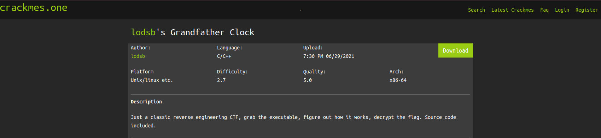
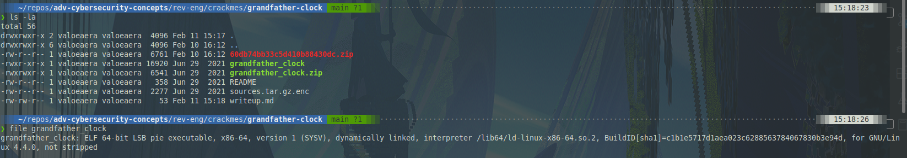
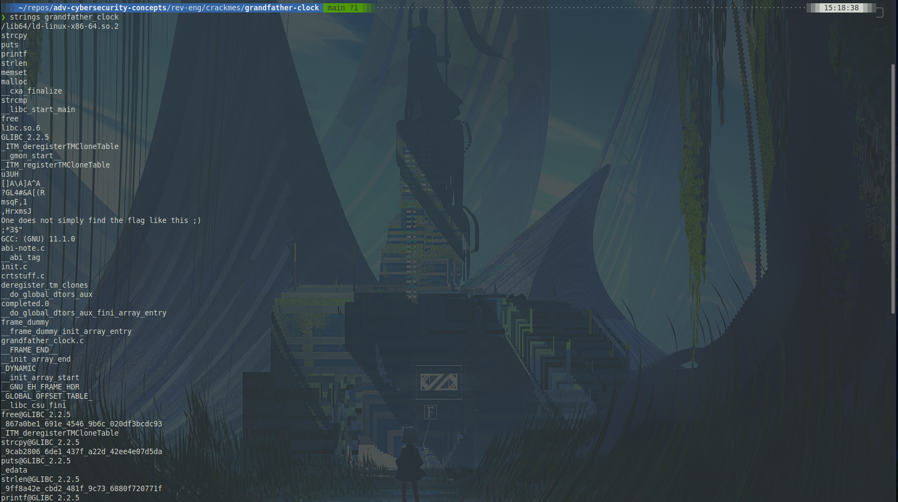
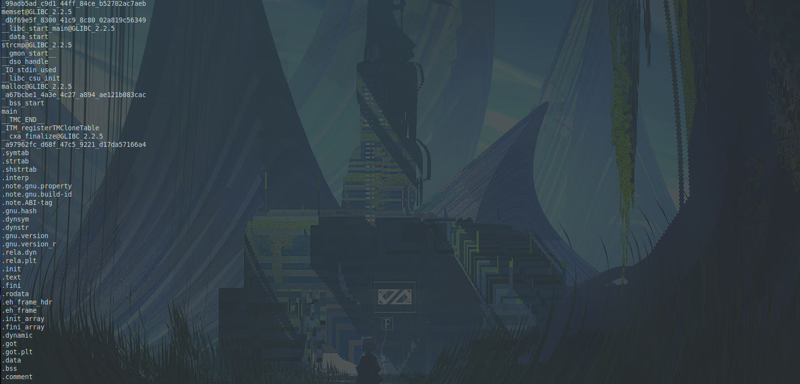
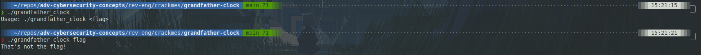
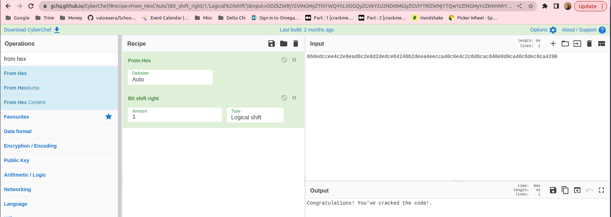
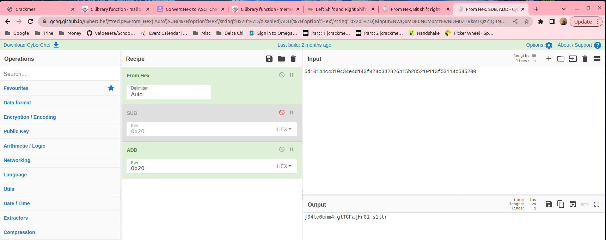
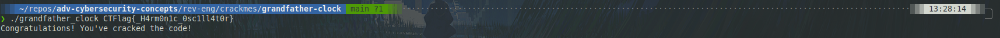

## Static Analysis



I started off by downloading and unzipping the challenge. Using `file`, I determined that this file is ELF 64-bit executable.




In the file's strings, I can see I lot of interesting things. There are some C functions at the top, there's a message about "not finding the flag like this". Then I can see some headers near the bottom.

## Dynamic Analysis



When I run the program, it tells me to provide an argument. That argument is the flag for the challenge, and obviously I don't have it.

## Decompiling -- Ghidra

```c++
// main()

undefined8 main(int param_1,undefined8 *param_2)

{
  int iVar1;
  undefined8 uVar2;
  size_t sVar3;
  char *__s2;

  if (param_1 == 1) { // If there is
    _9ff8a42e_cbd2_481f_9c73_6880f720771f(*param_2);
    uVar2 = 1;
  }
  else {
    sVar3 = strlen((char *)param_2[1]);
    if ((sVar3 & 1) == 0) {
      __s2 = (char *)_99adb5ad_c9d1_44ff_84ce_b52782ac7aeb(param_2[1]);
      iVar1 = strcmp(_867a0be1_691e_4546_9b6c_020df3bcdc93,__s2);
      if (iVar1 == 0) {
        _a97962fc_d68f_47c5_9221_d17da57166a4(_a67bcbe1_4a3e_4c27_a894_ae121b083cac);
        uVar2 = 0;
      }
      else {
        _a97962fc_d68f_47c5_9221_d17da57166a4(_dbf69e5f_8300_41c9_8c80_02a819c56349);
        uVar2 = 1;
      }
    }
    else {
      _a97962fc_d68f_47c5_9221_d17da57166a4(_dbf69e5f_8300_41c9_8c80_02a819c56349);
      uVar2 = 1;
    }
  }
  return uVar2;
}
```

`main()` performs a couple of functions for the program:

1. Check the number of arguments (`param_1`). If it only receives one argument (the name of the function counts as an argument), it prints the usage statement and returns 1.

   ```bash
       ~/crackmes/grandfather-clock ❯ ./grandfather_clock
       Usage: ./grandfather_clock <flag>
   ```

1. Next, `main()` checks the length of the string argument supplied to it. `sVar3 & 1` returns `0` if `sVar3` (which holds the length of the string) is even. If it is odd (i.e. `1` is returned), the program jumps to line 28. It then calls a function called \_a979... with a value of \_dbf6... and returns 1. I'll refer to functions and variable names that are obfuscated like this by their first 4 hex characters.

1. Next, the value returned by `99ad(param_2)` assigned to `__s2`, which is `strcmp()`'d to the variable `867a`. If that comparison fails, the program does the same thing as above: calls `a979(dbf6)` and returns 1. If the comparison succeeds, the program instead calls `a979(a67b)` and returns 0.

Guessing by the multiple if-else statements, I would assume that returning 1 indicates an incorrect flag and 0 indicates a correct flag. To confirm this, I'll look at the decompiled code for `a979()` and use that to decode the hex value stored in `a67b`.

```c++
// a979()

void _a97962fc_d68f_47c5_9221_d17da57166a4(char *param_1)

{
  size_t sVar1;
  void *__s;
  char *pcVar2;
  long local_20;

  sVar1 = strlen(param_1);
  __s = malloc(sVar1 + 1);
  pcVar2 = (char *)memset(__s,0,sVar1 + 1);
  pcVar2 = strcpy(pcVar2,param_1);
  local_20 = 0;
  while (pcVar2[local_20] != '\0') {
    pcVar2[local_20] = (byte)pcVar2[local_20] >> 1;
    local_20 = local_20 + 1;
  }
  puts(pcVar2);
  free(pcVar2);
  return;
}
```

First, the function does some memory allocation and copying shenanigans. The important part here is `pcVar2[local_20] = (byte)pcVar2[local_20] >> 1`. The function creates a copy of the parameter and then bit shifts that copy to the right by 1 bit (the `>>` operator is the bit shift right operator and the 1 indicates how many bits to shift by). Then, that value is printed. To understand what `a67b` contains, all that I need to do is grab the hex value stored at that label and run it through the following CyberChef recipe.



Nice! This is indeed the success message. Now that I've confirmed that this the `strcmp()` is the thing that determines the correctness of the key, I can use the same process to find the key.

The input is hashed by `99ad(param_2)` and then compared to `867a`. So, if I see how the input is hashed, I can use CyberChef to run `867a` through the reverse of that.

```c++
// 99ad()

void * _99adb5ad_c9d1_44ff_84ce_b52782ac7aeb(char *param_1)

{
  size_t sVar1;
  void *pvVar2;
  char local_39;
  ulong local_38;
  long local_30;

  sVar1 = strlen(param_1);
  local_38 = 0;
  local_30 = sVar1 - 1;
  local_39 = -2;
  pvVar2 = malloc(sVar1 + 1);
  pvVar2 = memset(pvVar2,0,sVar1 + 1);
  for (; local_38 < sVar1; local_38 = local_38 + 1) {
    *(char *)(local_38 + (long)pvVar2) = param_1[local_30] + -0x20;
    local_30 = local_30 + local_39;
    if (local_30 == -1) {
      local_30 = 0;
      local_39 = -local_39;
    }
  }
  return pvVar2;
}
```

The hashing function is a lot simpler than it first appears. It cyphers each character and then reorders them in a deterministic way. First, some initial conditions are set:

- `sVar1` - length of the input string
- `local_38` - iterator; this will make the loop execute for each character
- `local_30` - length of the string minus 1; this determines the character in the string that the algorithm is manipulating on this iteration
- `local_39` - skip value; this controls what the next character to manipulate is.

Then, the algorithm manipulates the string. Each character has `0x20` subtracted from it, so to undo that, I'll have to add `0x20`.

`local_30` starts at the last character in the string, so that is the first character to be manipulated and appended to the output. Then, with each iteration, the algorithm hits every other character. When the algorithm would reach an index of -1, it sets `local_30` to the start of the string and takes every other character in the other direction. This is why the algorithm ensures an even-length string, it needs the two halves to be equal in length.

For example:

```c++
// Starting with:
99ad('abcdefgh')
// Returns:
'hfdbaceg'
```

To get the scrambled string, I first ran the hex value contained in `867a` through this CyberChef recipe.



Then, I unscrambled the output by hand, netting `CTFlag{_H4rm0n1c_0sc1ll4t0r}`.


