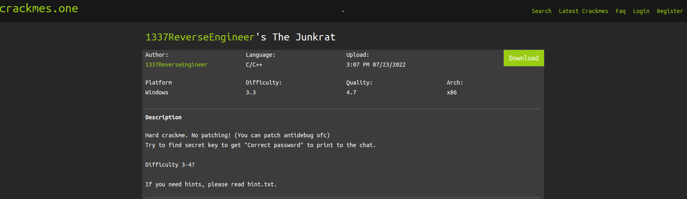

## Static Analysis

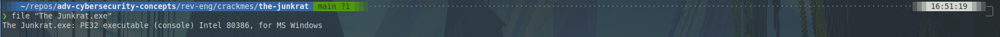

I started off by downloading and unzipping the challenge. Using `file`, I determined that this file is PE32 for Windows.

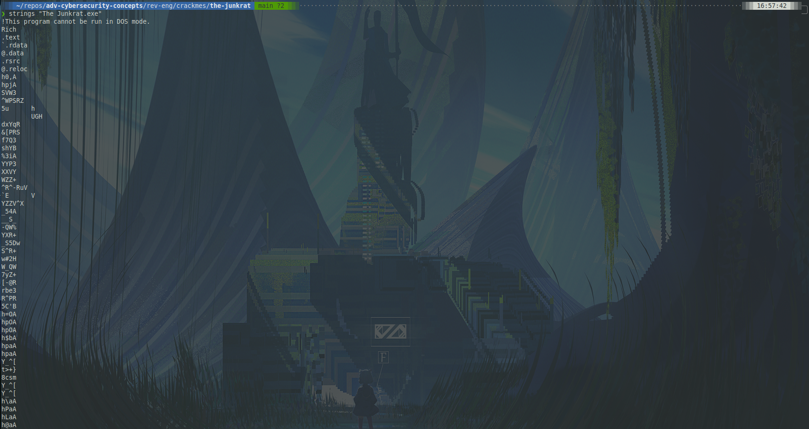
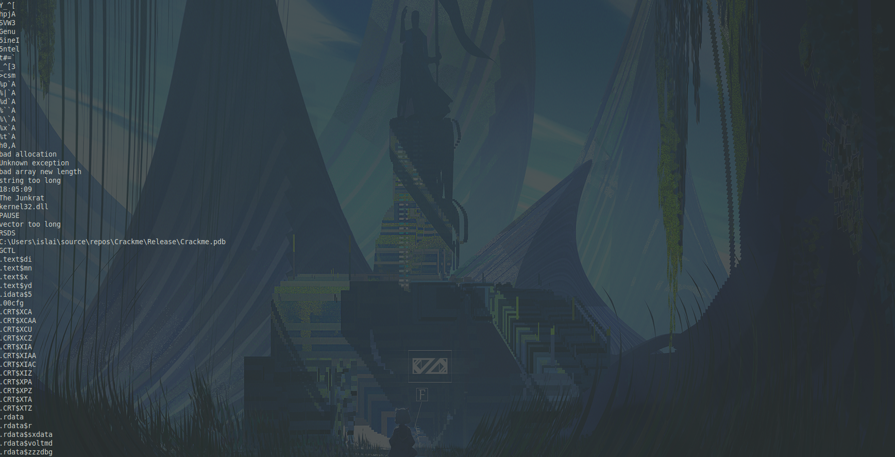
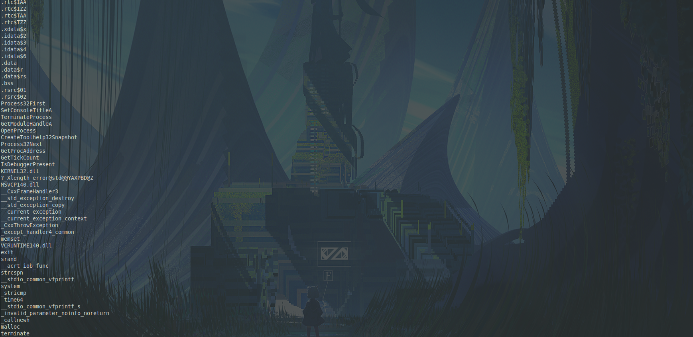
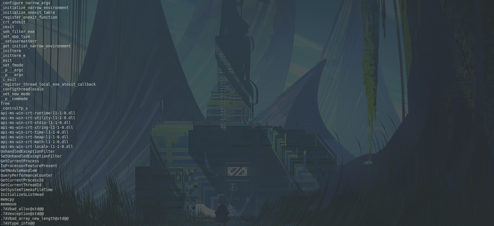
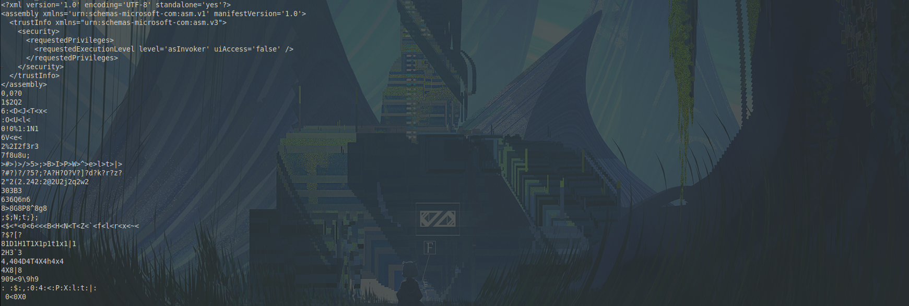

In the file's strings, I can see I lot of interesting things. I see a lot of strings. There is a filepath, many DLLs, and some repetitive scrambled strings. Then I can see many headers near the bottom.

## Dynamic Analysis

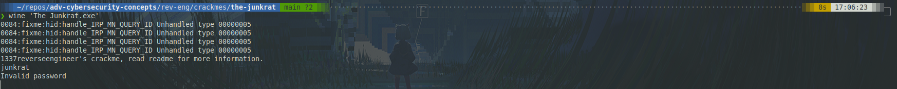

When I run the program, I see that the program expects me to type a password after running the program. Since I don't have this password, I'll need to decompile the program.

## Decompiling -- Ghidra

```c++
// entry()

void entry(void)

{
  ___security_init_cookie();
  FUN_00414463();
  return;
}
```

The entry point just calls `FUN_00414463()`, so I'll open that up.

```c++
// 00414463()

int FUN_00414463(void)

{
  code *pcVar1;
  bool bVar2;
  undefined4 uVar3;
  int iVar4;
  code **ppcVar5;
  int *piVar6;
  undefined4 *puVar7;
  uint uVar8;
  int unaff_ESI;
  undefined4 uVar9;
  undefined4 uVar10;
  void *local_14;

  uVar3 = ___scrt_initialize_crt(1);
  if ((char)uVar3 != '\0') {
    bVar2 = false;
    uVar3 = ___scrt_acquire_startup_lock();
    if (DAT_004183b4 != 1) {
      if (DAT_004183b4 == 0) {
        DAT_004183b4 = 1;
        iVar4 = _initterm_e(&DAT_00416150,&DAT_0041615c);
        if (iVar4 != 0) {
          ExceptionList = local_14;
          return 0xff;
        }
        _initterm(&DAT_00416140,&DAT_0041614c);
        DAT_004183b4 = 2;
      }
      else {
        bVar2 = true;
      }
      ___scrt_release_startup_lock((char)uVar3);
      ppcVar5 = (code **)FUN_00414b7c();
      if ((*ppcVar5 != (code *)0x0) &&
         (uVar3 = ___scrt_is_nonwritable_in_current_image((int)ppcVar5), (char)uVar3 != '\0')) {
        pcVar1 = *ppcVar5;
        uVar10 = 0;
        uVar9 = 2;
        uVar3 = 0;
        _guard_check_icall();
        (*pcVar1)(uVar3,uVar9,uVar10);
      }
      piVar6 = (int *)FUN_00414b82();
      if ((*piVar6 != 0) &&
         (uVar3 = ___scrt_is_nonwritable_in_current_image((int)piVar6), (char)uVar3 != '\0')) {
        _register_thread_local_exe_atexit_callback(*piVar6);
      }
      uVar9 = _get_initial_narrow_environment();
      puVar7 = (undefined4 *)__p___argv();
      uVar3 = *puVar7;
      puVar7 = (undefined4 *)__p___argc();
      unaff_ESI = FUN_00401d40(*puVar7,uVar3,uVar9);
      uVar8 = FUN_004149ce();
      if ((char)uVar8 != '\0') {
        if (!bVar2) {
          _cexit();
        }
        ___scrt_uninitialize_crt(1,'\0');
        ExceptionList = local_14;
        return unaff_ESI;
      }
      goto LAB_004145d6;
    }
  }
  FUN_004148ab(7);
LAB_004145d6:
                    /* WARNING: Subroutine does not return */
  exit(unaff_ESI);
}
```

A function `FUN_00401d40` is called with variables set to the result of `argc()` and `argv()`, which suggest user-supplied arguments. This is what prompted me to investigate this function, which is frankly massive. I think the program declares each address it touches as a separate variable, which leads to 18,000+ lines of "code".

```c++
// Lines 18509 - 18544; near the end of the while(true)

  {
    {
      {
LAB_0041249f:
        local_25cc = -(uint)bVar10 | 1;
        goto LAB_004124aa;
      }
      if (local_1be == 0) break;
      local_1bf = local_1cc[1];
      bVar10 = local_1bf < local_1d0[1];
      if (local_1bf != local_1d0[1]) goto LAB_0041249f;
      local_1cc = local_1cc + 2;
      local_1d0 = local_1d0 + 2;
    } while (local_1bf != 0);
    local_25cc = 0;
LAB_004124aa:
    local_25fc = local_25cc;
    if (local_25cc == 0) {
      puStack_266c = (undefined *)0x4124c8;
      FUN_00401ba0(&local_30);
      puStack_266c = (undefined *)0x4124d4;
      FUN_004012c0(&local_30,bVar1);
      goto LAB_00412604;
    }
    puStack_266c = (undefined *)0x4124e7;
    FUN_004012c0(&local_1c,bVar1);
    BVar3 = IsDebuggerPresent();
    if (BVar3 != 0) {
                    /* WARNING: Subroutine does not return */
      puStack_266c = &UNK_00412500;
      exit(-10);
    }
    iVar8 = FUN_00401c30();
    if (0 < iVar8) {
                    /* WARNING: Subroutine does not return */
      puStack_266c = (undefined *)0x4125ff;
      exit(-10);
    }
  } while( true );
```

`LAB_00412604` is the beginning of the `while(true)` loop that constitutes most of the non-declaration/definition content of this function. Right before the `goto` which points to this location, `FUN_00401ba0` is called with the address of `local_30`.

```c++
// FUN_00401ba0(character pointer) // XOR string @ param w/ 0x53

void __cdecl FUN_00401ba0(char *param_1)

{
  char cVar1;
  char *local_10;
  char *local_c;

  local_c = param_1;
  do {
    cVar1 = *local_c;
    local_c = local_c + 1;
  } while (cVar1 != '\0');
  for (local_10 = (char *)0x0; local_10 < local_c + (-1 - (int)(param_1 + 1));
      local_10 = local_10 + 1) {
    param_1[(int)local_10] = param_1[(int)local_10] ^ 0x53;
  }
  return;
}

```

`FUN_00401ba0()` takes a character pointer and XORs each character in the string pointed to with `0x53`.

```c++
// local_30 definition, lines 9239 - 9259
  IsDebuggerPresent();
  local_30 = '\x10';
  local_2f = 0x3c;
  local_2e = 0x21;
  local_2d = 0x21;
  local_2c = 0x36;
  local_2b = 0x30;
  local_2a = 0x27;
  local_29 = 0x73;
  local_28 = 0x23;
  local_27 = 0x32;
  local_26 = 0x20;
  local_25 = 0x20;
  local_24 = 0x24;
  local_23 = 0x3c;
  local_22 = 0x21;
  local_21 = 0x37;
  local_20 = 10;
  local_1f = 0;
  IsDebuggerPresent();
  IsDebuggerPresent();
```

This is the section of the function where `local_30` is defined.


Feeding this into CyberChef, I see that this is not the password, but the success message. This still lets me know that I'm in the right area of the program.

```c++
// FUN_00401d40, lines 9261 - 9276

  local_1c = '\x1a';
  local_1b = 0x3d;
  local_1a = 0x25;
  local_19 = 0x32;
  local_18 = 0x3f;
  local_17 = 0x3a;
  local_16 = 0x37;
  local_15 = 0x73;
  local_14 = 0x23;
  local_13 = 0x32;
  local_12 = 0x20;
  local_11 = 0x20;
  local_10 = 0x24;
  local_f = 0x3c;
  local_e = 0x21;
  local_d = 0x37;
```

Looking down a little further down in the program, there is a definition that looks similar to `local_30`. The same `FUN_00401ba0()` function is called before the `do(while)` (line 18425) with `local_1c` instead of `local_30`.

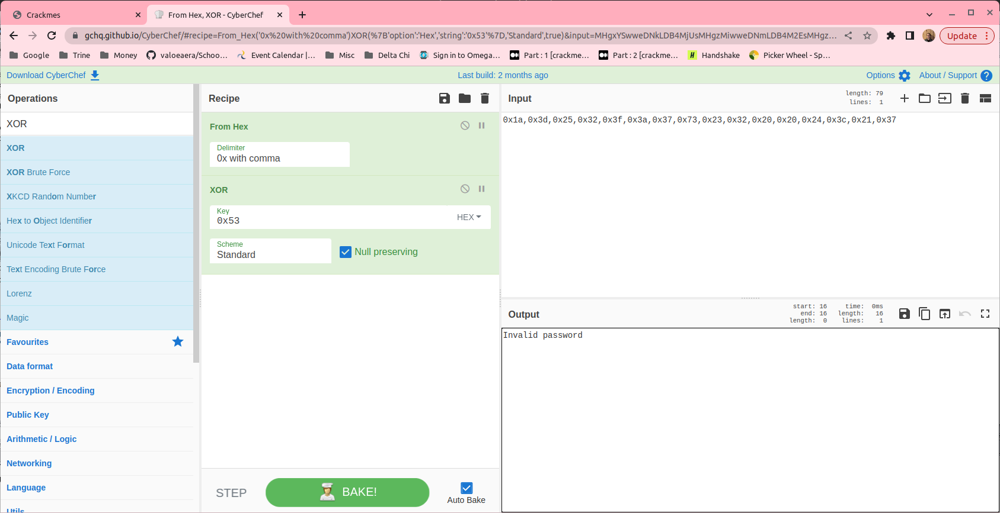

This turns out to be the invalid password output.

I looked around some more and found two more calls to this function near the top of the non-declaration/definition content which corresponds to the introductory comment that gets output first.

```c++
// lines 18503 - 18528

    FUN_00401ba0((char *)local_1ac);
    local_1d0 = &local_68;
    local_1cc = local_1ac;
    do {
      local_1be = *local_1cc;
      bVar10 = local_1be < *local_1d0;
      if (local_1be != *local_1d0) {
LAB_0041249f:
        local_25cc = -(uint)bVar10 | 1;
        goto LAB_004124aa;
      }
      if (local_1be == 0) break;
      local_1bf = local_1cc[1];
      bVar10 = local_1bf < local_1d0[1];
      if (local_1bf != local_1d0[1]) goto LAB_0041249f;
      local_1cc = local_1cc + 2;
      local_1d0 = local_1d0 + 2;
    } while (local_1bf != 0);
    local_25cc = 0;
LAB_004124aa:
    local_25fc = local_25cc;
    if (local_25cc == 0) {
      puStack_266c = (undefined *)0x4124c8;
      FUN_00401ba0(&local_30);
      puStack_266c = (undefined *)0x4124d4;
      FUN_004012c0(&local_30,bVar1);
      goto LAB_00412604;
    }
```

Going back to the success message, I can see that that bit of code only executes if `local_25cc` is 0. Looking to just before the `JMP` point, `local_25cc` is _set_ to 0 if the program escapes the `do(while)` loop immediately preceding it. That loop exits if `local_1bf` is _not_ 0. Inside the loop, there is a `goto` loop that executes if `local_1bf != local_1d0[1]`. Before the loop, `local_1d0` is set equal to the address of `local_68`.

```c++
// lines 13419 - 13449

  local_68 = 0x38;
  local_67 = 0x3c;
  local_66 = 0x3d;
  local_65 = 0x34;
  local_64 = 0x73;
  local_63 = 0x20;
  local_62 = 0x27;
  local_61 = 0x21;
  local_60 = 0x3c;
  local_5f = 0x3d;
  local_5e = 0x34;
  local_5d = 0x73;
  local_5c = 0x23;
  local_5b = 0x3a;
  local_5a = 0x20;
  local_59 = 0x27;
  local_58 = 0x32;
  local_57 = 0x32;
  local_56 = 0x73;
  local_55 = 0x23;
  local_54 = 0x32;
  local_53 = 0x3d;
  local_52 = 0x36;
  local_51 = 0x27;
  local_50 = 0x27;
  local_4f = 0x32;
  local_4e = 0x3e;
  local_4d = 0x32;
  local_4c = 0x32;
  local_4b = 0x6e;
  local_4a = 0;
```

`local_68` is defined similarly to the other strings with this "one-hex-character-at-a-time" routine.

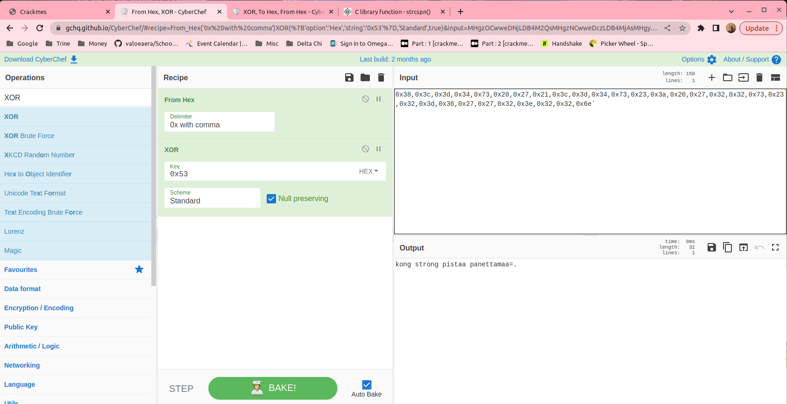

The last character look messed up and the string makes no sense. I'll have to do some bash magic to unscramble it.

```bash
#!/bin/bash
chars=( {a..z} )
n=26
for ((i=0; i<n; i++))
do
	echo "kong strong pistaa panettamaa${chars[i]}"
	echo "kong strong pistaa panettamaa${chars[i]}" | wine "The Junkrat.exe" | sed "/Invalid password/d" | sed "/1337*/d"& sleep 2
	PID=$!
	kill -INT $PID
done
```

This little script here loops through the lowercase letters from a-z and appends each to the string from CyberChef. Then that string is fed into the binary and the output is filtered to remove unsuccessful attempts. Then, each process (each run through spawns a new process) is killed after 2 seconds.

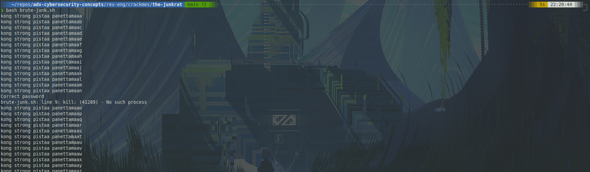

Here the script indicates that `n` should be the last letter.

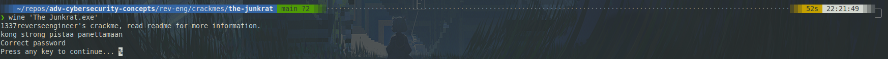

And here I confirm that that is indeed the password.
