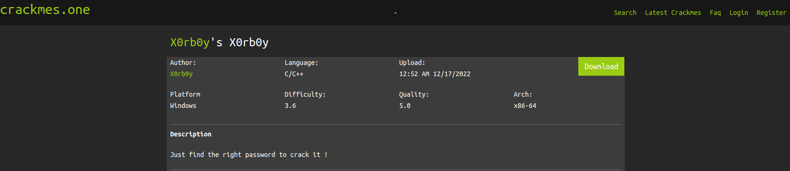
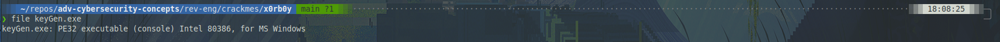
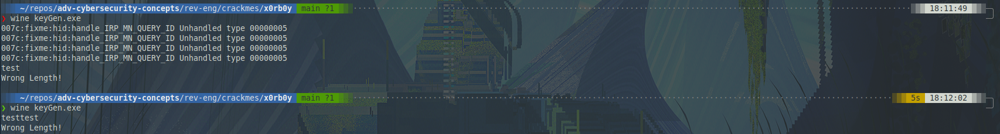
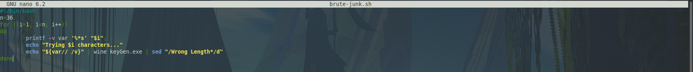
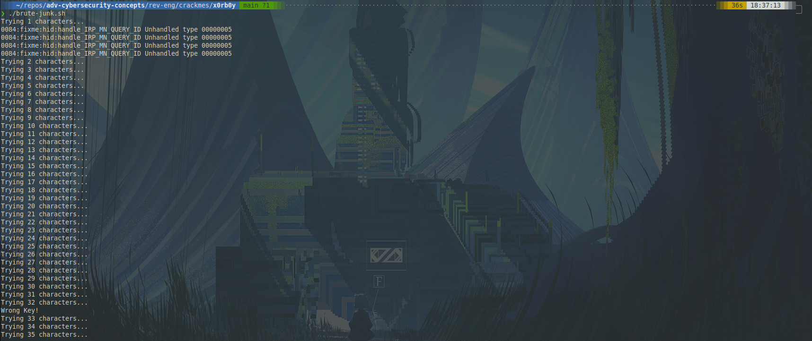
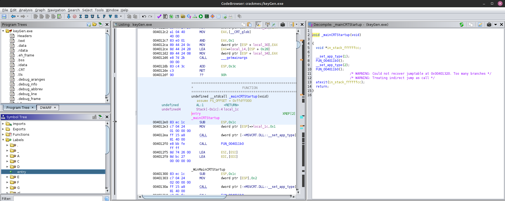
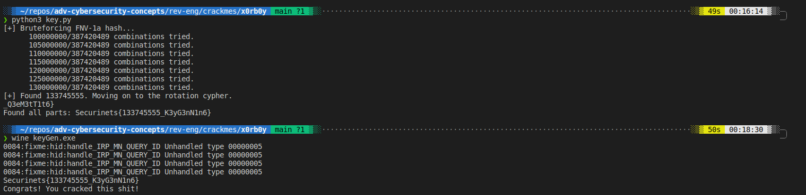

<!--truncate-->

## Static Analysis



I started off by downloading and unzipping the challenge. Using `file`, I determined that this file is PE32. I will have to run this program using wine.

## Dynamic Analysis



When I run the program, it expects an input. If that input is the wrong length, it tells me "Wrong Length!".



Using this simple bash script, I can fuzz the length of the input based on this error message. I figured 35 characters should be long enough, but if that had failed, I could simply increase the number of repetitions.



It turns out that the key is 32 characters long. Time to look through Ghidra.

## Decompiling -- Ghidra



The entry point for this program is under `labels` in the left pane. The function `FUN_004011b0` is called twice.

```c++
// FUN_004011b0()

void FUN_004011b0(void)

{
  code *pcVar1;
  int *piVar2;
  undefined4 *puVar3;
  UINT uExitCode;

  ___dyn_tls_init@12(0,2);
  _SetUnhandledExceptionFilter@4((LPTOP_LEVEL_EXCEPTION_FILTER)&LAB_00401000);
  ___cpu_features_init();
  _fesetenv(__CRT_fenv);
  __setargv();
  pcVar1 = _iob_exref;
  if (__CRT_fmode != 0) {
    __fmode = __CRT_fmode;
    __setmode(*(int *)(_iob_exref + 0x10),__CRT_fmode);
    __setmode(*(int *)(pcVar1 + 0x30),__CRT_fmode);
    __setmode(*(int *)(pcVar1 + 0x50),__CRT_fmode);
  }
  piVar2 = (int *)___p__fmode();
  *piVar2 = __fmode;
  __pei386_runtime_relocator();
  ___main();
  puVar3 = (undefined4 *)___p__environ();
  uExitCode = _main(__argc,DAT_00407000,(char **)*puVar3);
  __cexit();
                    /* WARNING: Subroutine does not return */
  _ExitProcess@4(uExitCode);
}
```

The function calls a function `_main()` near the end with `__argc` as an argument.

```c++
// _main()

int __cdecl _main(int _Argc,char **_Argv,char **_Env)

{
  size_t sVar1;
  int iVar2;
  char *_Str1;
  char local_80 [16];
  char local_70 [16];
  char local_60 [15];
  char acStack_51 [12];
  char acStack_45 [9];
  char acStack_3c [28];
  uint local_20;
  int local_1c;
  uint local_18;
  int local_14;

  ___main();
  _memset(acStack_51 + 1,0,0x30);
  _memset(local_60,0,0x10);
  _memset(local_70,0,0x10);
  _memset(local_80,0,0x10);
  local_1c = _read(0,acStack_51 + 1,0x28);
  acStack_51[local_1c] = '\0';
  sVar1 = _strlen(acStack_51 + 1);
  if (sVar1 == 0x20) {
    _strncpy(local_60,acStack_51 + 1,0xb);
    iVar2 = _strcmp(local_60,"Securinets{");
    if (iVar2 == 0) {
      _strncpy(local_70,acStack_45,9);
      local_14 = 1;
      local_18 = 0;
      while( true ) {
        sVar1 = _strlen(local_70);
        if (sVar1 <= local_18) break;
        if (9 < (int)local_70[local_18] - 0x30U) {
          local_14 = 0;
        }
        local_18 = local_18 + 1;
      }
      if (local_14 != 0) {
        local_20 = _fnv_1a_32(local_70);
        if (local_20 == 0xf9b9b765) {
          _strncpy(local_80,acStack_3c,0xc);
          _Str1 = (char *)_rot(local_80,6);
          iVar2 = _strcmp(_Str1,"_Q3eM3tT1t6}");
          if (iVar2 == 0) {
            _puts("Congrats! You cracked this sh*t!");
                    /* WARNING: Subroutine does not return */
            _exit(0);
          }
        }
      }
    }
    _puts("Wrong Key!");
  }
  else {
    _puts("Wrong Length!");
  }
  return 0;
}

```

Let's walk through this function 1 step at a time to figure out what it does. It looks rather simple to be rated this difficult, but we shall see.

The first bit of the program just initializes some variables and gets ready to check the input.

```c++
if (sVar1 == 0x20) {
    _strncpy(local_60,acStack_51 + 1,0xb);
    iVar2 = _strcmp(local_60,"Securinets{");
}
```

After checking the length of the string (`sVar1`), the program copies the first `0xb` (11) bytes from `acStack_51` to `local_60`. Then, `local_60` is compared to a hard-coded value. Seems easy enough so far.

```c++
if (iVar2 == 0) {
      _strncpy(local_70,acStack_45,9);
      local_14 = 1;
      local_18 = 0;
      while( true ) {
        sVar1 = _strlen(local_70);
        if (sVar1 <= local_18) break;
        if (9 < (int)local_70[local_18] - 0x30U) {
          local_14 = 0;
        }
        local_18 = local_18 + 1;
      }
      if (local_14 != 0) {
        local_20 = _fnv_1a_32(local_70);
      }
}
```

Provided the above check succeeded, the program then copies the next 9 bytes from the stack to `local_70`. The following loop is a rather interesting way of checking if the string contains only digits. A flag (`local_14`) is set to 1. Then, the string is looped over and if any character is greater than 9 (after `0x30` is subtracted, because 0's hex code is `0x30`), the flag is set to 0.

If the `local_14` flag is not 0, then the variable is sent as an argument to `_fnv_1a_32()`.

```c++
// _fnv_1a_32()

uint __cdecl _fnv_1a_32(char *param_1)

{
  char *local_c;
  uint local_8;

  local_8 = 0x811c9dc5;
  for (local_c = param_1; *local_c != '\0'; local_c = local_c + 1) {
    local_8 = (local_8 ^ (int)*local_c) * 0x1000193;
  }
  return local_8;
}
```

This is a fairly simple hashing function. It actually emulates a common hash type called Fowler-Noll-Vo-1, hence the function name. There is:

- `local_8`, which is an offset value
- `local_c`, which is the character to be hashed
- `0x1000193`, which is the prime number used in 32-bit FNV-1

Each byte of input data is

1. XOR'd with the offset
2. That value is multiplied by the prime number
3. The least-significant 32 bits of that value are fed into the next cycle as the offset

Unfortunately, there's not a great way to reverse this process because of the modulo step removing a lot of information from the key found in `main()`. Fortunately, this only takes a couple minutes in python to brute force. I have included a python file to generate the key in this folder. There relevant section of which is included below:

```py
for candidate_key in range(10**8,10**9) # Brute force all 9 digit numbers
    candidate_bytes = bytes(str(candidate_key), 'ascii')
    for character in range(len(candidate_bytes)) # For each digit in possible key, perform FNV-1a
        temp_key = (temp_key ^ candidate_bytes[character])
        temp_key = (temp_key * multiplier) % (2**32) # Take the 32 least significant bits as input for next FNV op
    if (temp_key == part2): # Break if we find a match (will find collisions if they are lower)
        dec_part2 = str(candidate_key)
        break
    temp_key = key # Reset to initialization vector
    if (candidate_key % (10**6 * 5) == 0) # Print progress every 5 or so percent
        print(" " * 6 + str(candidate_key) + "/" + str(9**9) + " combinations tried.")
```

In the above example, `part2` is the value taken from the if statement in `main()`.

```c++
if (local_20 == 0xf9b9b765) {
  _strncpy(local_80,acStack_3c,0xc);
  _Str1 = (char *)_rot(local_80,6);
  iVar2 = _strcmp(_Str1,"_Q3eM3tT1t6}");
  if (iVar2 == 0) {
    _puts("Congrats! You cracked this sh*t!");
            /* WARNING: Subroutine does not return */
    _exit(0);
  }
}
```

Finally, the program takes the next (or last, depending on perspective) `0xc` (12) bytes of input and feeds them into a function called `_rot()`. If the output matches some hard-coded value, then the success message is printed.

```c++
void * __cdecl _rot(char *param_1,int param_2)

{
  int iVar1;
  size_t sVar2;
  void *pvVar3;
  int local_10;

  sVar2 = _strlen(param_1);
  pvVar3 = _malloc(sVar2 + 1);
  for (local_10 = 0; local_10 < (int)sVar2; local_10 = local_10 + 1) {
    if ((param_1[local_10] < 'a') || ('z' < param_1[local_10])) {
      if ((param_1[local_10] < 'A') || ('Z' < param_1[local_10])) {
        *(char *)(local_10 + (int)pvVar3) = param_1[local_10];
      }
      else {
        iVar1 = param_1[local_10] + -0x41 + param_2;
        *(char *)(local_10 + (int)pvVar3) = (char)iVar1 + (char)(iVar1 / 0x1a) * -0x1a + 'A';
      }
    }
    else {
      iVar1 = param_1[local_10] + -0x61 + param_2;
      *(char *)(local_10 + (int)pvVar3) = (char)iVar1 + (char)(iVar1 / 0x1a) * -0x1a + 'a';
    }
  }
  *(undefined *)((int)pvVar3 + sVar2) = 0;
  return pvVar3;
}
```

Taking a look at `_rot()`, it does a couple of things:

- Checks if the input corresponds to a special character in ASCII
  - If it does, return it unchanged
- Checks the case of the character
  - The case determines the offset value
  - Since capital `A` corresponds to `0x41` and `a` corresponds to `0x61`
- The program subtracts the hex value corresponding to either `A` or `a`
- The program adds the rotation shift
- The program adds back in the `A` or `a` value, accounting for if the shifted value is no longer a letter

Essentially, this creates a rotation cypher of the original value, shifted by some integer (in this case, 6).

Again, I have included the entire python file I used to generate the key, but the relevant snippet is below:

```py
def get_sign(num):          # Gets the sign of an int
    if (num > 0):
        return 1
    elif (num < 0):
        return -1
    else:
        return 0


def shift_char(char_byte, char_shift):
    return_val = char_byte
    if (return_val>= bytes('a', 'ascii') and return_val<= bytes('z', 'ascii')):     # If value is a letter, shift it
        return_val = int(byte.hex(), 16) + char_shift
        if return_val not in range(97, 122):                                        # If value is shifted out of the alphabet, loop to opposite end
            return_val = return_val - ((get_sign(char_shift)) * 26)
    elif (return_val>= bytes('A', 'ascii') and return_val<= bytes('Z', 'ascii')):   # Same for uppercase letters
        return_val = int(byte.hex(), 16) + char_shift
        if return_val not in range(65, 90):
            return_val = return_val - ((get_sign(char_shift)) * 26)
    else:
        return_val = int(byte.hex(), 16)                                            # Do not shift special characters
    return return_val

for character_2 in range(len(temp_str)):                                            # Shift each char in input
    byte = bytes(temp_str[character_2], 'ascii')
    byte = shift_char(byte, shift)                                                  # Shift a byte by shift, returns decimal of the char code of the output
    char_code = hex(byte)[2:4]                                                      # hex() dirties output with '0x', take the stuff after that
    dec_part3 = dec_part3 + bytes.fromhex(char_code).decode("ascii")
```



Here the python script finds a valid string and that string works when fed into the program! Multiple valid strings could be found, as FNV-1a does have some collision issues, but this was the first number that worked.
