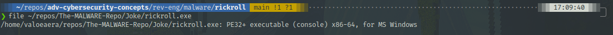
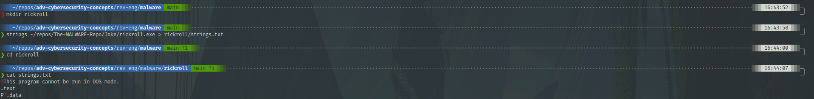
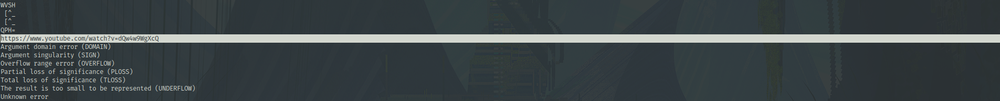
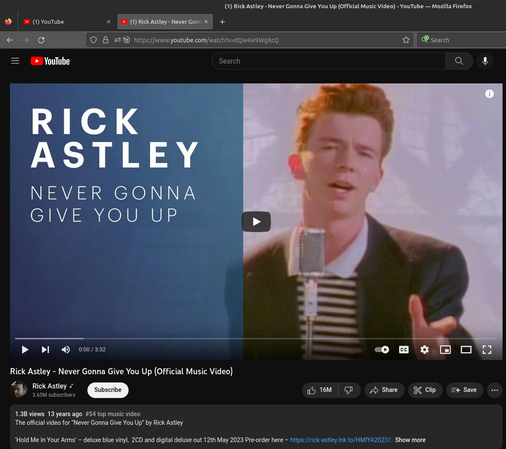
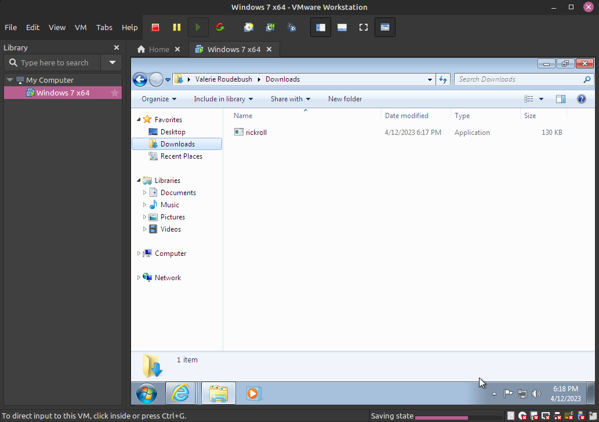
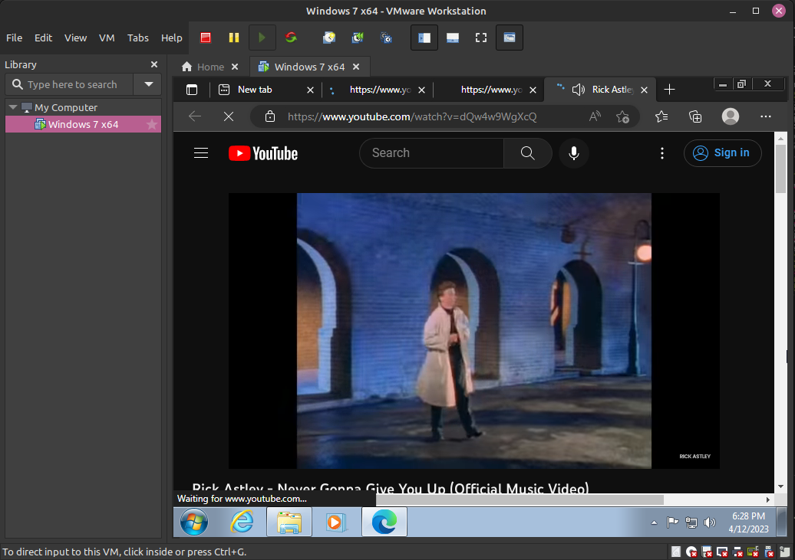

## Info

Analysis of `rickroll.exe` from the MALWARE repository

Link: https://github.com/Da2dalus/The-MALWARE-Repo

Disclaimer: This repository hosts actual malware. Some of it is jokes, like the file analyzed in this writeup, but exercise due caution.

Performed: 12 April 2023 by valoeaera

<!--truncate-->

## Static Analysis

I started off by using static analysis techniques. Some malware programmers will try to obfuscate or otherwise evade detection with their programs by packing or otherwise scrambling their code. Using some basic static analysis techniques can reveal a great deal about the file:

- Is the program packed or obfuscated?
- If it is packed, how or with what program is it packed?
- If it is obfuscated, are there any pieces of identifiable information that can be gathered?
- If the program is neither packed nor obfuscated, do the strings or filetype hint at any functionality?



Using `file`, I determined that this file is indeed a PE32+ executable, as the extension would hint. Even if there is a file extension, it is still useful to run `file`, as the malware creator may have appended a misleading file extension to trick gullible users. In this case, the extension and filetype match.



This sample's `strings` output is rather large, I had to up my command scrollback from my preferred 1000 lines in order to view it all. This indicates that the file is very unlikely to be packed or obfuscated, which means Ghidra should work for decompilation.



In the first couple dozen lines, I found a youtube link. This checks out given the name of the executable.

## Dynamic Analysis

Were I not analyzing "malware" in this instance, say with a crackme challenge, I would run the executable with wine to see what it does. In this case, I will visit the link to show what the binary will do what executed.



The link does in fact point to the Rick Astley song "Never Gonna Give You Up", as I suspected. I will analyze this program further with Ghidra to see what it does specifically.

## Decompiling -- Ghidra

```c++
int __cdecl main(int _Argc,char **_Argv,char **_Env)

{
  SHORT SVar1;

  __main();
  FreeConsole();
  do {
    do {
      SVar1 = GetAsyncKeyState(0x45);
    } while (-1 < SVar1);
    ShellExecuteA((HWND)0x0,(LPCSTR)0x0,"https://www.youtube.com/watch?v=dQw4w9WgXcQ",(LPCSTR)0x0,
                  (LPCSTR)0x0,5);
  } while( true );
}
```

When I throw the program to Ghidra, the decompiled code is incredibly simple, spanning only 18 lines its C-like pseudocode form. First, the program allocates a two-byte integer called `SVar1`.

```c++
void __main(void)

{
  if (initialized != 0) {
    return;
  }
  initialized = 1;
  __do_global_ctors();
  return;
}
```

Then the program calls a function called `__main()`, the pesudocode of which is shown above. If the program is already initialized (i.e. initialized is not 0), it simply does nothing and returns. If the program is not initialized, it sets initialized to 1 and executes `__do_global_ctors()`, which is a function created by the compiler to walk the constructors section of the executable, constructing golbal objects.

Going back to the `main()` function, `FreeConsole()` is the next instruction. It is a Windows function that detached the process from the console it is attached to. Next, the program enters a `while(true)` loop, which will execute indefinitely.

Then, the program enters a nested `do while` loop, this loop executes until a function `GetAsyncKeyState()` returns a value of -1. `GetAsyncKeyState()` is another Windows function. It determines the state of a specified key at the time the function is called: up or down, and whether or not the key was pressed after the previous `GetAsyncKeyState()` call. In simpler terms, the program will only continue to the rest of this function when the key passed to `GetAsyncKeyState()` is pressed. The value in this case is `0x45`, which, according to [Microsoft Documentation](https://learn.microsoft.com/en-us/windows/win32/inputdev/virtual-key-codes), is the "E" key.

After the "E" key is pressed, the program calls a final Windows function: `ShellExecuteA()`. This function has quite a few parameters, but this call is fairly simple once its documentation is consulted.

1. The first argument (called `hwnd`) is used to handle error messages. In this case, NULL is passed, which means that this program will not generate error windows.

1. The second argument (called `lpOperation`) is the "verb" to be executed, such as "edit", "find", or in the case of `(LPCSTR)0x0`, "open".

1. The third argument (called `lpFile`) is the target of the aforementioned verb, in this case, a link to the video.

1. The fourth argument (called `lpParameters`) specifies any parameters that an executable file pointed to by `lpFile` may require. Since `lpFile` points to a link in this case, `lpParameters` is `(LPCSTR)0x0` (NULL).

1. The fifth argument (called `lpDirectory`) specifies the working directory of the operation. Again, NULL is passed so the working directory, so the current working directory is used.

1. The final argument (called `nShowCmd`) specifies how the application is to be displayed. Since `lpFile` indicates a web page, the display window (likely Internet Explorer or other default browser) is set to "SHOW", indicated by the `5` as translated by the [documentation](https://learn.microsoft.com/en-us/windows/win32/api/winuser/nf-winuser-showwindow).

This is a very complex way of saying that the program opens the link after the "E" key is pressed.

## Demonstration



I've set up a Windows 7 VM that is isolated from my host OS and downloaded the `rickroll` executable. I will now execute the program.



Now, every time I press "E", a new tab in Microsoft Edge opens the youtube video. Very quickly, my VM runs out of RAM and crashes. Luckily, I can revert to the snapshot I took before running the program!
