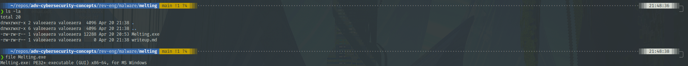
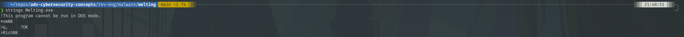
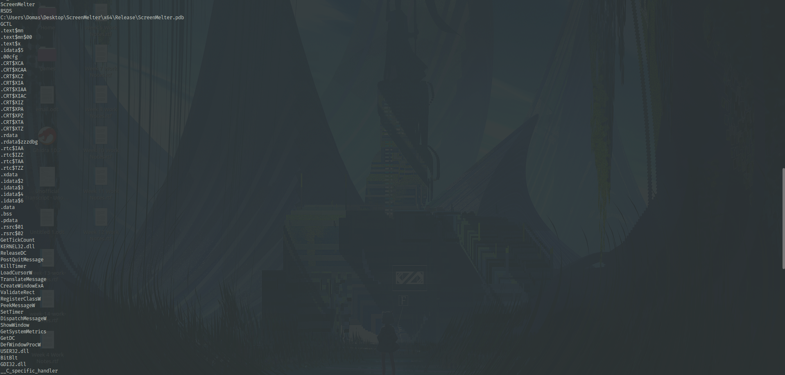
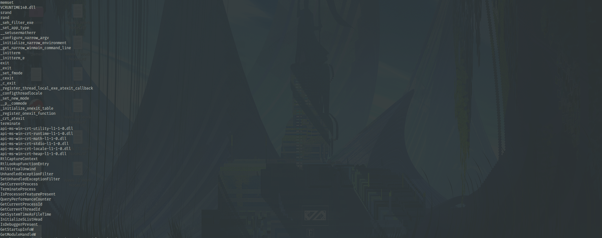

## Info

Analysis of `Melting.exe` from the MALWARE repository

Link: https://github.com/Da2dalus/The-MALWARE-Repo

Disclaimer: This repository hosts actual malware, exercise due caution.

Performed: 20 April 2023 by valoeaera

## Static Analysis

I started off by using static analysis techniques. Some malware programmers will try to obfuscate or otherwise evade detection with their programs by packing or otherwise scrambling their code. Using some basic static analysis techniques can reveal a great deal about the file:

- Is the program packed or obfuscated?
- If it is packed, how or with what program is it packed?
- If it is obfuscated, are there any pieces of identifiable information that can be gathered?
- If the program is neither packed nor obfuscated, do the strings or filetype hint at any functionality?



Using `file`, I determined that this file is indeed a PE32+ executable, as the extension would hint. Even if there is a file extension, it is still useful to run `file`, as the malware creator may have appended a misleading file extension to trick gullible users. In this case, the extension and filetype match.



This sample's `strings` output is rather large. This indicates that the file is very unlikely to be packed or obfuscated, which means Ghidra should work for decompilation.




In the first couple dozen lines, I can see all of the imported Windows functions. There are a lot of functions that interface with Windows alerts: `TranslateMessage`, `DispatchMessageW`, `CreateWindow`. Based on the presence of `IsDebuggerPresent`, it also has some anti-analysis measures in place.

## Dynamic Analysis

When trying to run the file in my Virtual Machine sandbox, it errors out, likely due to some anti-sandboxing measures. Typically malware creators will try to prevent the application from running in a sandbox in order to deter analysts. Perhaps more information can be gleaned in decompilation.

## Decompiling -- Ghidra

```c++
//entry()
void entry(void)

{
  initialization();
  main();
  return;
}
```

Above is the entry point function. The first function contains some initialization, along with some sandbox-checking. The second function is the main function. I've labelled these and other functions for demonstration, but it is important to note that these functions do not have human-readable names normally and that these names are not representative of the original names of these functions.

```c++
//main() - lines 43-58
if ((*plVar5 != 0) &&
    (uVar3 = __scrt_is_nonwritable_in_current_image((longlong)plVar5), (char)uVar3 != '\0')) {
_register_thread_local_exe_atexit_callback(*plVar5);
}
__scrt_get_show_window_mode();
_get_narrow_winmain_command_line();
pIVar6 = &IMAGE_DOS_HEADER_140000000;
unaff_EBX = window_creator((HINSTANCE)&IMAGE_DOS_HEADER_140000000);
uVar3 = __scrt_is_managed_app();
if ((char)uVar3 != '\0') {
if (!bVar1) {
    _cexit();
}
__scrt_uninitialize_crt(CONCAT71((int7)((ulonglong)pIVar6 >> 8),1),'\0');
return unaff_EBX;
}
```

This section of `main()` is the important one:

1. `__scrt_get_show_window_mode()` is a Microsoft C function that checks whether the application window is visible.
2. `_get_narrow_winmain_command_line()` is another Microsoft C function that gets command-line arguments.
3. Next it calls a custom function that I've named "window_creator".

```c++
window_creator()

void window_creator(HINSTANCE program_instance)

{
  ATOM window_class;
  DWORD _Seed;
  BOOL is_message_present;
  HWND window_handler;
  undefined auStackY_f8 [32];
  undefined window_info [64];
  wchar_t *local_58;
  undefined message_data [48];
  ulonglong local_18;

  local_18 = DAT_140005000 ^ (ulonglong)auStackY_f8;
  screen_width = GetSystemMetrics(0);
  screen_height = GetSystemMetrics(1);
  window_info._0_4_ = 0;
  window_info._8_8_ = (WNDPROC)&message_handler;
  window_info._16_8_ = 0;
  window_info._32_8_ = (HICON)0x0;
  window_info._24_8_ = program_instance;
  window_info._40_8_ = LoadCursorW((HINSTANCE)0x0,(LPCWSTR)0x7f00);
  window_info._48_16_ = ZEXT816(0);
  local_58 = L"ScreenMelter";
  window_class = RegisterClassW((WNDCLASSW *)window_info);
  if (window_class != 0) {
    window_handler =
         CreateWindowExA(8,"ScreenMelter",(LPCSTR)0x0,0x80000000,0,0,screen_width,screen_height,
                         (HWND)0x0,(HMENU)0x0,program_instance,(LPVOID)0x0);
    if (window_handler != (HWND)0x0) {
      _Seed = GetTickCount();
      srand(_Seed);
      message_data._0_8_ = (HWND)0x0;
      message_data._8_8_ = 0;
      message_data._16_8_ = 0;
      message_data._24_8_ = 0;
      message_data._32_8_ = 0;
      message_data._40_8_ = 0;
      do {
        is_message_present = PeekMessageW((LPMSG)message_data,(HWND)0x0,0,0,1);
        if (is_message_present != 0) {
          TranslateMessage((MSG *)message_data);
          DispatchMessageW((MSG *)message_data);
        }
      } while (message_data._8_4_ != 0x12);
    }
  }
  __security_check_cookie(local_18 ^ (ulonglong)auStackY_f8);
  return;
}
```

This function is fairly simple. It defines some information about a window. Then, it creates a class to define that window. The window it creates is as tall and wide as the screen, obtained from calls to `GetSystemMetrics()`, with 0 being for the screen width and 1 being for the screen height. Then, it initializes a message data block and uses `PeekMessageW()` to generate the message content. Finally, it draws that message inside of the window using a do-while loop to create many instances of the message. The calls to `srand()` is used to randomize these instances and make it appear as if the screen is "melting".
